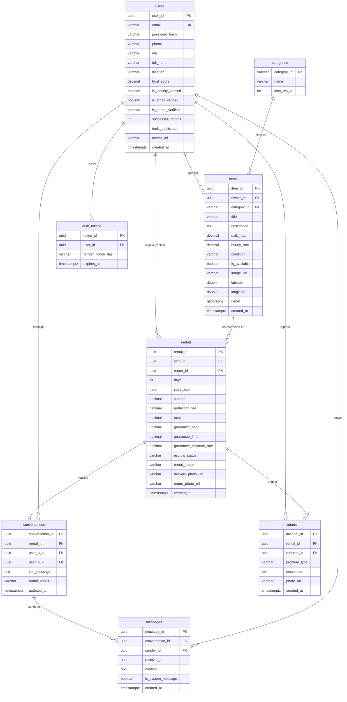

# Prezto — Contrato de API y Esquemas

Documento maestro para el backend (PostgreSQL + PostGIS). Los nombres de campo en snake_case del API mapean 1:1 con los DTOs/modelos de la app (indicados entre paréntesis).

Convenciones:
- Todos los montos en soles (PEN), tipo `decimal(10,2)`.
- Fechas en ISO-8601 UTC; timestamps en epoch millis donde la app ya los usa.
- Autenticación: header `Authorization: Bearer <access_token>` (lo inyecta `AuthInterceptor`).
- Errores: HTTP estándar; el cliente mapea con `ErrorMapper` (401/403, 404, 429, 5xx).

---

## 1. Endpoints

| Endpoint | Método | Descripción | Request Body (Campos) | Response Body (Campos) |
| :--- | :--- | :--- | :--- | :--- |
| `/auth/register` | POST | Registro inicial (no autentica; dispara OTP) | `email`, `password`, `phone`, `dni`, `full_name` | `user_id`, `status` |
| `/auth/verify` | POST | Verificación OTP del celular (emite sesión) | `phone`, `otp_code` | `access_token`, `refresh_token`, `user_id` |
| `/auth/login` | POST | Inicio de sesión | `email`, `password` | `access_token`, `refresh_token`, `user_id` |
| `/auth/refresh` | POST | Renueva el access token (usado por `TokenAuthenticator`) | `refresh_token` | `access_token`, `refresh_token` |
| `/auth/forgot-password` | POST | Envía enlace de recuperación | `email` | `status` |
| `/auth/resend-otp` | POST | Reenvía el código (countdown 60s en cliente) | `phone` | `status` |
| `/items` | GET | Listado por cercanía (query params) | `lat`, `lon`, `radius`, `category`, `q` | `[ { item_id, title, daily_rate, latitude, longitude, owner_trust, condition, image_url, is_available } ]` |
| `/items/{item_id}` | GET | Detalle de herramienta | — | `item_id`, `title`, `description`, `daily_rate`, `hourly_rate`, `condition`, `image_url`, `latitude`, `longitude`, `owner`, `is_available` |
| `/items` | POST | Publicar herramienta | `title`, `description`, `daily_rate`, `category_id`, `condition`, `latitude`, `longitude`, `image_url` | `item_id`, `status` |
| `/profile` | GET | Currículum de confianza | — | `user_id`, `full_name`, `location`, `trust_score`, `is_identity_verified`, `is_email_verified`, `is_phone_verified`, `successful_rentals`, `tools_published`, `avatar_url` |
| `/profile` | PUT | Editar perfil | `full_name`, `location`, `avatar_url` | `status` |
| `/profile/verify-identity` | POST | Verificación KYC del DNI | `dni`, `selfie_url` | `is_identity_verified`, `status` |
| `/rental/quote` | POST | Cotización (desglose dinámico) | `item_id`, `days` | `rental_quote` ({ `days`, `subtotal`, `protection_fee`, `total` }), `guarantee` ({ `base_amount`, `final_amount`, `discount_rate` }) |
| `/rental/checkout` | POST | Crear reserva (retiene fondos en bóveda) | `item_id`, `days`, `start_date` | `rental_id`, `escrow_status` |
| `/rental/{rental_id}/delivery` | POST | Check-in fotográfico de entrega | `photo_url` | `rental_status` |
| `/rental/{rental_id}/return` | POST | Check-out fotográfico de devolución (libera Escrow) | `photo_url` | `rental_status`, `escrow_status` |
| `/chat/conversations` | GET | Bandeja de entrada | — | `[ { conversation_id, other_user_name, other_user_avatar_url, tool_title, last_message, rental_status, has_unread } ]` |
| `/chat/{conversation_id}/messages` | GET | Historial de mensajes | — | `[ { message_id, sender_id, receiver_id, content, timestamp, is_system_message } ]` |
| `/chat/send` | POST | Enviar mensaje (filtrado anti-fuga server-side) | `conversation_id`, `content`, `type` | `message_id`, `timestamp` |
| `/support/incident` | POST | Reportar incidencia | `problem_type`, `description`, `photo_url`, `rental_id` | `incident_id`, `status` |

---

## 2. Esquemas de Base de Datos (PostgreSQL + PostGIS)

### `users`
| Columna | Tipo | Notas (DTO app) |
| :--- | :--- | :--- |
| `user_id` | uuid PK | |
| `email` | varchar unique | `email` |
| `password_hash` | varchar | nunca se devuelve |
| `phone` | varchar(9) | `phone` |
| `dni` | varchar(8) | `dni` |
| `full_name` | varchar | `fullName` |
| `location` | varchar | `location` |
| `trust_score` | decimal(2,1) | `trustScore` (0.0–5.0) |
| `is_identity_verified` | boolean | `isIdentityVerified` |
| `is_email_verified` | boolean | `isEmailVerified` |
| `is_phone_verified` | boolean | `isPhoneVerified` |
| `successful_rentals` | int | `successfulRentals` |
| `tools_published` | int | `toolsPublished` |
| `avatar_url` | varchar null | `avatarUri` |
| `created_at` | timestamptz | |

### `items`
| Columna | Tipo | Notas (DTO app) |
| :--- | :--- | :--- |
| `item_id` | uuid PK | `id` |
| `owner_id` | uuid FK users | `owner.id` |
| `category_id` | varchar FK categories | `categoryId` |
| `title` | varchar | `title` |
| `description` | text | `description` |
| `daily_rate` | decimal(10,2) | `dailyRate` |
| `hourly_rate` | decimal(10,2) | `hourlyRate` |
| `condition` | varchar enum | `currentCondition` (NEW, GOOD, FAIR, NEEDS_REPAIR) |
| `is_available` | boolean | `isAvailable` |
| `image_url` | varchar | `imageUrl` |
| `latitude` | double precision | `latitude` |
| `longitude` | double precision | `longitude` |
| `geom` | geography(Point,4326) | índice GiST para `ST_DWithin` |
| `created_at` | timestamptz | |

### `categories`
| Columna | Tipo | Notas |
| :--- | :--- | :--- |
| `category_id` | varchar PK | `id` |
| `name` | varchar | `name` |
| `icon_res_id` | int null | `iconResId` |

### `rentals`
| Columna | Tipo | Notas (DTO app) |
| :--- | :--- | :--- |
| `rental_id` | uuid PK | |
| `item_id` | uuid FK items | `item_id` |
| `renter_id` | uuid FK users | |
| `days` | int | `RentalQuote.days` |
| `start_date` | date | `start_date` |
| `subtotal` | decimal(10,2) | `RentalQuote.subtotal` |
| `protection_fee` | decimal(10,2) | `RentalQuote.protectionFee` |
| `total` | decimal(10,2) | `RentalQuote.total` |
| `guarantee_base` | decimal(10,2) | `Guarantee.baseAmount` |
| `guarantee_final` | decimal(10,2) | `Guarantee.finalAmount` |
| `guarantee_discount_rate` | decimal(3,2) | `Guarantee.discountRate` |
| `escrow_status` | varchar enum | PENDING, PAID, RELEASED |
| `rental_status` | varchar enum | `RentalStatus` (AWAITING_DELIVERY, IN_PROGRESS, FINISHED) |
| `delivery_photo_url` | varchar null | check-in |
| `return_photo_url` | varchar null | check-out |
| `created_at` | timestamptz | |

### `conversations`
| Columna | Tipo | Notas (DTO app) |
| :--- | :--- | :--- |
| `conversation_id` | uuid PK | `id` |
| `rental_id` | uuid FK rentals | |
| `user_a_id` | uuid FK users | |
| `user_b_id` | uuid FK users | |
| `last_message` | text | `lastMessage` |
| `rental_status` | varchar enum | `rentalStatus` |
| `updated_at` | timestamptz | |

### `messages`
| Columna | Tipo | Notas (DTO app) |
| :--- | :--- | :--- |
| `message_id` | uuid PK | `id` |
| `conversation_id` | uuid FK conversations | |
| `sender_id` | uuid | `senderId` |
| `receiver_id` | uuid | `receiverId` |
| `content` | text | `content` (filtrado anti-fuga) |
| `is_system_message` | boolean | `isSystemMessage` |
| `created_at` | timestamptz (epoch ms) | `timestamp` |

### `incidents`
| Columna | Tipo | Notas (DTO app) |
| :--- | :--- | :--- |
| `incident_id` | uuid PK | |
| `rental_id` | uuid FK rentals null | |
| `reporter_id` | uuid FK users | |
| `problem_type` | varchar | `problemType` |
| `description` | text | `description` |
| `photo_url` | varchar null | `photoUri` |
| `created_at` | timestamptz | |

### `auth_tokens` (o gestionado por JWT sin tabla)
| Columna | Tipo | Notas |
| :--- | :--- | :--- |
| `token_id` | uuid PK | |
| `user_id` | uuid FK users | |
| `refresh_token_hash` | varchar | rotación en `/auth/refresh` |
| `expires_at` | timestamptz | |

---

## 3. Enums

| Enum | Valores | Modelo app |
| :--- | :--- | :--- |
| `condition` | NEW, GOOD, FAIR, NEEDS_REPAIR | `ItemCondition` |
| `escrow_status` | PENDING, PAID, RELEASED | `EscrowStatus` (+ RELEASED en backend) |
| `rental_status` | AWAITING_DELIVERY, IN_PROGRESS, FINISHED | `RentalStatus` |
| `trust_level` (derivado) | NEW, STANDARD, TRUSTED, ELITE | `TrustLevel` (derivado de `trust_score`) |

---

## 4. Diagrama Entidad-Relación

---

## 5. Reglas de negocio que el backend debe imponer

- **Tarifa de Protección Prezto:** `protection_fee = subtotal * 0.08`.
- **Comisión Prezto:** `owner_payout = subtotal * 0.90` (10% de comisión).
- **Garantía Dinámica:** `base = daily_rate * 4`; descuento por nivel — ELITE 50%, TRUSTED 30%, STANDARD 10%, NEW 0%.
- **Escrow:** los fondos se liberan al propietario solo tras `/rental/{id}/return`.
- **Escudo Anti-Fuga:** `/chat/send` debe rechazar/enmascarar teléfonos y URLs mientras `escrow_status = PENDING`.
- **Regla de disputa de 2 horas:** ventana para reportar fallas tras el check-in.
- **Rate limiting:** `/auth/login` y `/auth/verify` con HTTP 429 + header `Retry-After`.
- **Geo:** `/items` resuelve cercanía con `ST_DWithin(geom, ST_MakePoint(lon, lat)::geography, radius_m)`.
